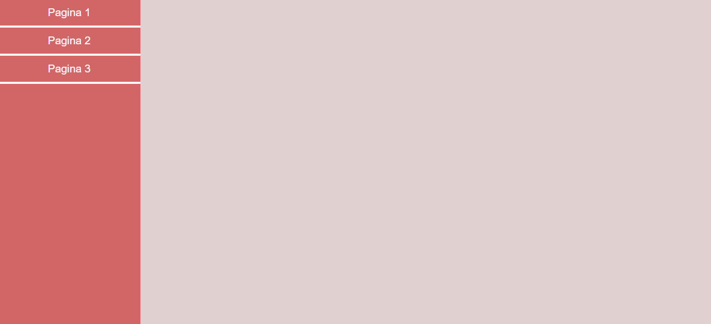
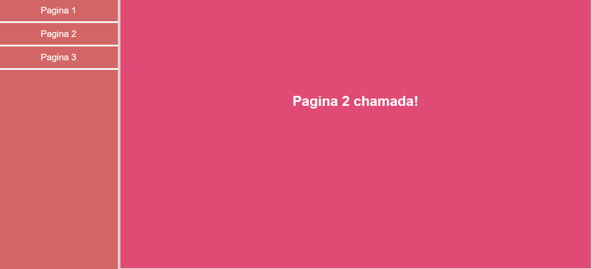
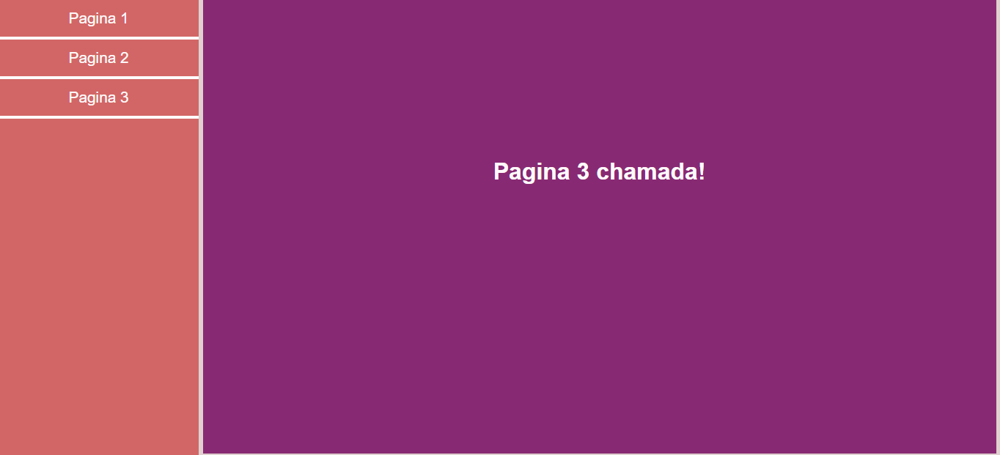

#  Carregamento  de conteúdo  atrav  de  um menu  em JS, HTML e CSS
Exemplo simples de um Menu lateral que realiza o carregamento do conteúdo dentro da mesma pagina.

##screenshot:

Após selecionar uma das opções abaixo será carre carregado um conteúdo...
![Imagem  que retrata o conteúdo carregado após  a seleção de botão](Carrega Conteudo/Imagens/img1.

